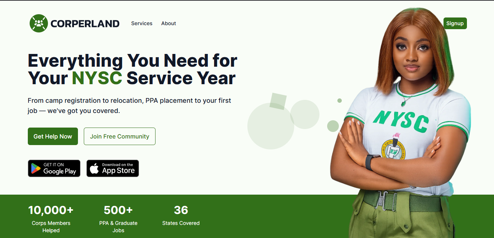
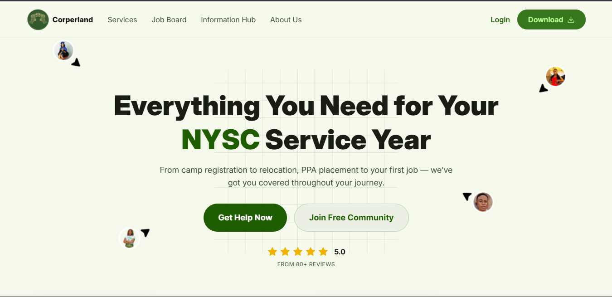

# Corperland Redesign – A Modern Web Redesign Case Study

## 🎯 About the Project

Corperland is a comprehensive information and support platform designed for **NYSC (National Youth Service Corps) corps members**. The site helps young service members navigate their NYSC experience by providing essential information, resources, guidance, and community support.

## ✨ What We Did

This project is a **complete modern redesign** that transformed Corperland into a sleeker, more accessible, and highly interactive platform. While the original site performed well technically, we focused on delivering an exceptional **user experience and visual appeal** that keeps corps members engaged.

### Key Improvements

**🎨 Modern Design System**

- Revised the UI with a clean, contemporary aesthetic
- Consistent, cohesive visual language
- Improved typography and color hierarchy for better readability

**♿ Enhanced Accessibility**

- Implemented semantic HTML and ARIA labels for screen readers
- Better keyboard navigation support
- Improved contrast ratios and focus indicators
- More inclusive design for all users

**⚡ Interactive & Engaging UX**

- Smooth animations and transitions using Animate.css
- Interactive components that respond intuitively to user actions
- Better visual feedback on interactions
- Enhanced user engagement throughout the site

**📱 Responsive & Mobile-First**

- Fully responsive design that looks stunning on all devices
- Mobile-optimized navigation and layouts
- Touch-friendly interactive elements

## 🖼️Before & After

### Design Transformation

| Before                       | After                               |
| ---------------------------- | ----------------------------------- |
| Dated, cluttered interface   | Clean, modern aesthetic             |
| Basic navigation structure   | Intuitive, user-friendly navigation |
| Static, minimal interactions | Smooth animations and engaging UX   |
| Limited visual hierarchy     | Clear typography and color system   |
| Decreased mobile experience  | Fully responsive across all devices |

**Before:** The original Corperland site worked well functionally but felt outdated. Navigation was basic, the visual design lacked personality, and there were minimal interactive elements to engage users.

**After:** The redesigned Corperland features a contemporary, polished interface with smooth animations, improved accessibility, and an engaging user experience that keeps corps members coming back.

| Before                                        | After                                          |
| --------------------------------------------- | ---------------------------------------------- |
|  |  |

## 🔧 Tech Stack

Built with modern, performant tools for optimal speed and SEO:

- **React 19** – Component-based architecture for maintainability
- **Vite** – Lightning-fast build tool and dev server
- **Tailwind CSS** – Utility-first CSS for rapid, consistent styling
- **Lucide React** – Beautiful, customizable icon library
- **Animate.css** – Smooth, professional animations

## 🚀 Performance & SEO

- **Fast Load Times** – Vite's optimized bundling ensures quick page loads
- **SEO Optimized** – Clean HTML structure, semantic markup, and fast performance
- **Modern Best Practices** – ESLint integration for code quality

## 📦 Getting Started (for developers)

```bash
# Install dependencies
npm install

# Start development server
npm run dev

# Build for production
npm run build

# Preview production build
npm run preview

# Run linting
npm run lint
```

## 📂 Project Structure

```
src/
├── components/        # Reusable React components
├── pages/            # Page-level components
├── constants/        # Static data and media
├── assets/           # Images and fonts
├── App.jsx           # Root application component
└── main.jsx          # Entry point
```

## 🎯 Why This Redesign Matters

For a platform serving thousands of NYSC corps members, **design quality directly impacts engagement and trust**. By modernizing the interface and improving accessibility, we made the platform:

- **More Trustworthy** – Clean, professional design builds credibility
- **More Engaging** – Interactive elements keep users coming back
- **More Inclusive** – Accessibility ensures all users can benefit
- **More Discoverable** – Better SEO and UX improve search visibility

---

**Agency Note:** This project showcases our expertise in transforming established platforms into modern, user-centric web experiences. We specialize in redesigns that prioritize design excellence, accessibility, and conversion-focused UX.
